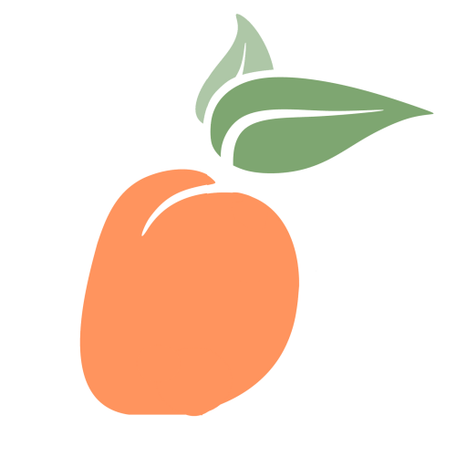

<h1 align="center">  BSides Augusta CTF 2023 </h1>

<h3 align="center">🏆 Third Place Winner </h3>

Writeups of the BSides Augusta CTF in partnership with HackTheBox (HTB) that took place October 7th, 2023 at the [BSides Augusta 10th Annual Conference](https://bsidesaugusta.org/).

> I tried not to use downloadable software or a virtual machine during this CTF so some of the tools that I directly mentioned that I used are pretty abnormal. But, I couldn’t run a VM on my laptop, didn’t wanna install a bunch of stuff w/ low memory, and thought it was a fun showcase that you do not need a full Kali or Arch set-up. (I didn’t even have python installed 💀)
> 

## Web

[ 🪐 Interdimensional Calculator - 375pts](InterdimensionalCalculator.md)

[ 🍪 Broken Production - 550pts](BrokenProduction.md)

## Crypto

[ 🤷‍♂️ Lost - 400 pts (WIP)](Lost.md)

[ ✈️ On Air - 1000pts (NOT DONE)](OnAir.md)

## Reversing (even tho I didn’t complete it, it is very interesting)

[ 🤖 ircbot - 1000pts (WIP)](ircbot.md)

## Forensics

[ 🔓 Firensics - 275pts](Firensics.md)


```
💗 For inquiries please reach me at @alphyos on Discord
```
